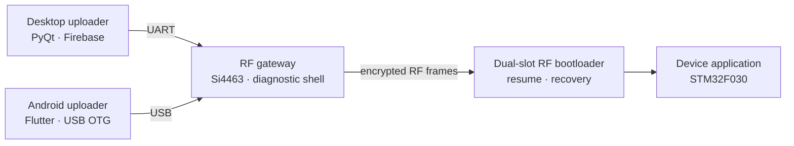

## About me

I design **AI agent systems** and **embedded firmware** — and increasingly, the two together.
Most of my work lives in private repositories: an agent daemon that ships code across my GitHub fleet,
a multi-provider canvas for Claude Code, Codex and Gemini, a persistent memory layer for LLMs,
and a complete encrypted RF firmware-update ecosystem for STM32 devices.

This page is the portfolio view of that work. Public repositories are linked; private ones are marked.

## AI & agent systems

<table>
<tr>
<td width="50%" valign="top">

### [conclave](https://github.com/Emirfs/conclave)
 

Local, daemon-first workspace for multiple AI coding providers. Claude Code, Codex, Antigravity and Ollama sessions live as cards on an infinite canvas. Cards relay, review and debate each other's answers, and work keeps running after the UI closes.

</td>
<td width="50%" valign="top">

### ghd
 

Autonomous agent daemon that watches my GitHub repository fleet. It connects local AI CLIs to controlled GitHub work: implementing issues, reviewing PRs, fixing review findings, syncing docs and proposing conflict resolutions.

</td>
</tr>
<tr>
<td width="50%" valign="top">

### [mnemo](https://github.com/Emirfs/mnemo)
 

Persistent, portable, cross-AI memory over a plain Markdown vault. Push-based auto-recall injects relevant past work into the model's context without being asked. Backed by a private vault of my own engineering notes.

</td>
<td width="50%" valign="top">

### [WID — Works In Debug](https://github.com/Emirfs/WID)
 

Claude Code agent system for STM32 development. Agents build, flash and debug on real hardware. The RF firmware-update chain below was developed and tested with it.

</td>
</tr>
<tr>
<td width="50%" valign="top">

### [multi-ai-manager](https://github.com/Emirfs/multi-ai-manager)
  

Desktop control panel for Claude, Codex, Gemini, Ollama and Mistral CLIs. Task queue with dependencies, approvals, shared memory, agent profiles, and token and cost estimates.

</td>
<td width="50%" valign="top">

### [opus-5-5-playbook](https://github.com/Emirfs/opus-5-5-playbook)
 

Agent rule and prompting skill for Claude Opus 5.5, derived from the official guide. Works with Oh My Pi, Claude Code and Cursor.

</td>
</tr>
<tr>
<td width="50%" valign="top">

### [ai-news-hub — Neural Pulse](https://github.com/Emirfs/ai-news-hub)
 

Autonomous AI and frontier-tech journal. Hourly dispatches, trending open-source models and multi-language briefings, produced without manual editing.

</td>
<td width="50%" valign="top">

### Agent UX experiments
  

**herdr-plugin-pets:** an animated terminal pet per running agent that reflects its state.
**yes-i-am-working:** a desktop narrative app that runs on local Codex, Claude Code or Antigravity subscriptions.

</td>
</tr>
</table>

## Embedded & firmware systems

### Encrypted RF firmware-update ecosystem
      

An end-to-end system for updating STM32 devices over the air, built across more than a dozen repositories.
Firmware images travel as encrypted frames. The gateway is an opaque bridge and never decrypts them.
Devices write updates into one slot and keep the running image as a backup, so a failed update can recover.

| Component | What it does |
| --- | --- |
| RF gateway, sender and receiver firmware | Si4463 and Si4432 radio bridges with a built-in diagnostic shell |
| Dual-slot RF bootloaders | Safe updates for 256 KB STM32F030 devices, with a backup slot and boot confirmation |
| `firmware-updater` | Desktop app for RF/UART OTA, device provisioning and Firebase integration |
| Mobile RF OTA uploader | Flutter app that updates devices from a phone through the RF bridge |
| `mobile-stm32-programmer` | Android app that flashes STM32 through a directly connected ST-LINK over USB Host and SWD |
| `embedded-libs` | Shared library family: bootloader, OTA, cryptography, persistent storage, device identity, drivers |
| [FirmwareUpdate_RF](https://github.com/Emirfs/FirmwareUpdate_RF) | Public reference version of the full chain |

### Hardware & digital design

| Project | Summary | Stack |
| --- | --- | --- |
| **VaxGuard** *(private)* | Autonomous cold-chain case for vaccines. It classifies breaches, logs the responsible user via RFID, and warns early with on-device TinyML | KiCad · BLE · TinyML |
| **Rotary knob HMI** *(private)* | Firmware for a 1.3" round display knob on STM32C0, with a UART link to an ESP32 | STM32 · TouchGFX |
| **ESP32-C6 dev board** *(private)* | Custom development board, schematic and PCB | KiCad |
| [**AES256_vhdl**](https://github.com/Emirfs/AES256_vhdl) | AES-256 encryption core with key expansion and testbenches | VHDL · Vivado |

## AI usage

Every project above was built together with AI coding agents. This is how much I have used each of them.

## Tech stack

## GitHub activity

<picture>
  <source media="(prefers-color-scheme: dark)" srcset="https://raw.githubusercontent.com/Emirfs/Emirfs/output/snake.svg" />
  
</picture>

